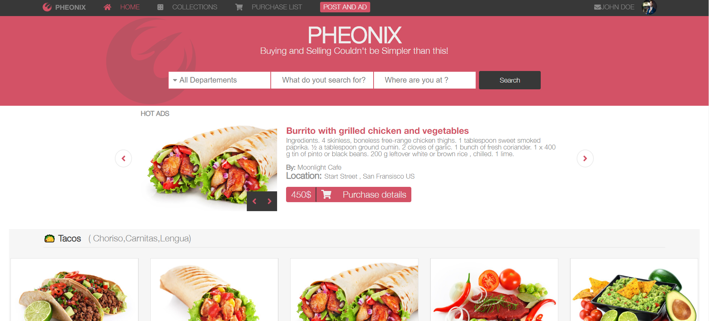
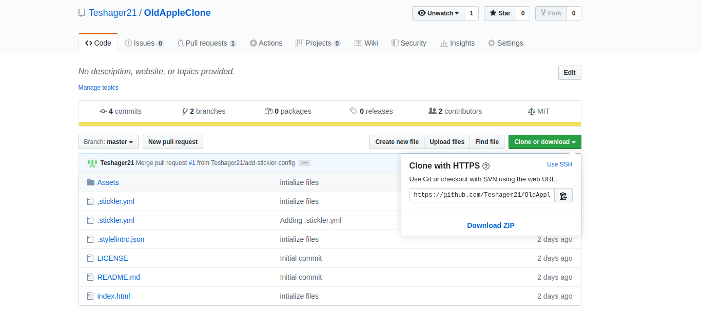

#  Capstone Project - Pheonix Fast Food
In this project, I demonstrated my ability  to build a web site from design. I made a fictitious company, and I used the layout color and topography dictated by adobe file of the [designer](https://www.behance.net/gallery/24796463/ZATTIX), 
This fictitious company,[Pheonix](https://online-fast-food.netlify.app) is in a fast food company that delivers fast food at doorsteps from the nearby kitchens. The content of this website doesn't hold a factual data.

    

## Built With

- Plain HTML5,
- Pure CSS3,

## Live Demo

[Live Demo Link](https://online-fast-food.netlify.app)
## Milestone

  To match with the original click [here](https://www.behance.net/gallery/24796463/ZATTIX)
## Getting Started

To get a local copy up and running follow these simple example steps.

### How to install using Command line

    1. Click on the install or download button under the repository name and grab the url
    by clicking on the clipboard icon

    2.open your terminal

    3.Navigate to the location in your computer where you want the repo to be cloned

    4. Type git clone  and paste the url you copied on step one.

        $ git clone https://github.com/YOUR-USERNAME/YOUR-REPOSITORY

    5. Press Enter. Your local clone will be created.

                $ git clone https://github.com/YOUR-USERNAME/YOUR-REPOSITORY
                > Cloning into `Spoon-Knife`...
                > remote: Counting objects: 10, done.
                > remote: Compressing objects: 100% (8/8), done.
                > remove: Total 10 (delta 1), reused 10 (delta 1)
                > Unpacking objects: 100% (10/10), done.

### Usage

    In any browser, open the index.html file

## Authors

👤 **Author**

- Gmail: [Teshager Admasu](mailto:teshager8922@gmail.com)
- Github: [@teshager21](https://github.com/teshager21)
- Twitter: [@Teshage84907805](https://twitter.com/Teshage84907805)
- Linkedin: [Teshager Admasu](https://www.linkedin.com/in/teshager-admasu-0000011a2/)

## 🤝 Contributing

    Contributions, issues and feature requests are welcome!

Feel free to check the [issues page](https://github.com/Teshager21/online-shop-capstone/issues).

## Show your support

Give a ⭐️ if you like this project!

## Acknowledgments

- Design concepts was inspired by [Mohammed Awad and others on Behance](https://www.behance.net/gallery/24796463/ZATTIX)
- Images gotten from [pexels.com](https://www.pexels.com/)
- Icons from [font awesome](https://fontawesome.com/)

## 📝 License
This project is [MIT](lic.url) licensed.

